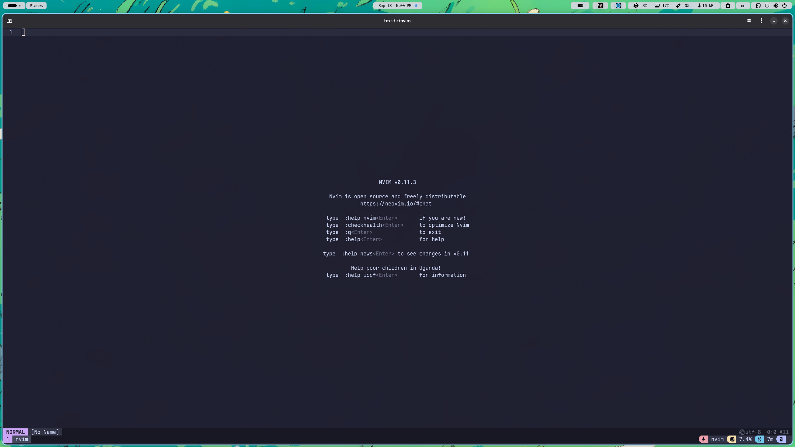
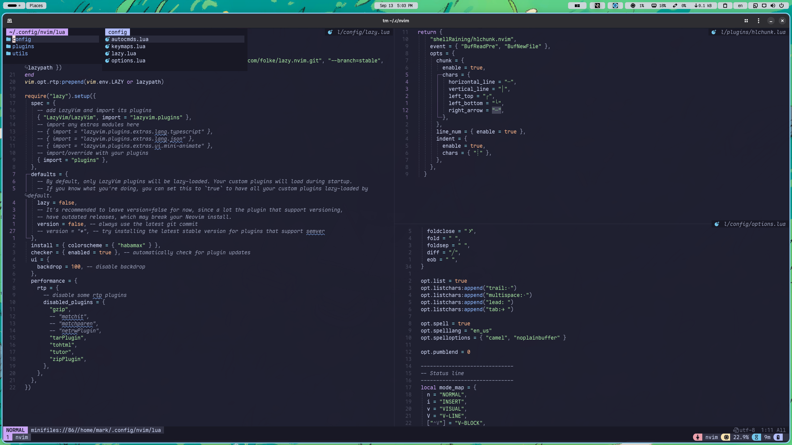

# Lazyvim Configuration

This repository contains my personal Lazyvim configuration optimized for my workflow and preferences.

## Screenshots




## Usage

Clone this repo into your `~/.config/nvim` directory and start Neovim. Adjust as needed for your setup.

```bash
git clone https://github.com/manhhn01/lazyvim-config ~/.config/nvim
```

## License

This configuration is provided as-is under the MIT License.
